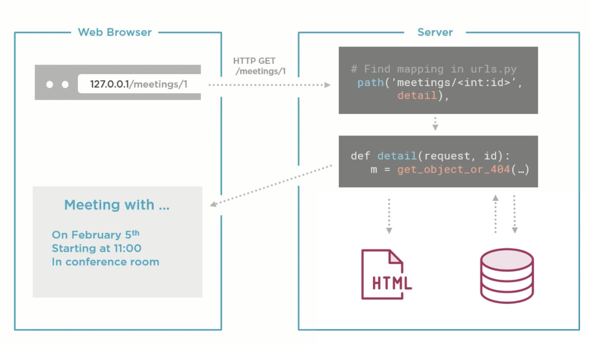

# django-fundamentals

Exercise of the Pluralsight course: Django Fundamentals by Reindert-Jan Ekker

## Built With

# django_getting_started
    django-admin startproject meetingplanner

#####   To link & create html to core project where views are linked in urls of coreproject
    python manage.py startapp website

- Add 'website' in INSTALLED_APPS of settings.py in meetingplanner
- Check URL mapping in urls.py file in meetingplanner if your url getting 404

##### Python Data Model & Migration
Data Model is actually a table of database. In other words, it linked to the database.
Migration is concept which keep the database up to date with whatever changes you have done in code and data model classes
- To see pending migration
        
         python manage.py showmigrations
- To run migration

         python manage.py migrate
         
##### Created Meeting Data Model
After creating Model class, you have to generate migration files to which later on migrate in database later on.

    python manage.py makemigrations

This commands create migration scripts under migrations/ folder.

To see the SQL syntax of our created Model, execute the following command

    python manage.py sqlmigrate meetings 0001
Here, 0001 is the index of our migration file under the meetings/migrations. folder.
Now run the migrate commnad to apply the changes in the database.

##### To create, edit data from inbuilt admin panel.
We have to configure the admin mapping in admin.py file.
To use the inbuilt admin panel, we required to create one super user.

##### To create super user
    python manage.py createsuperuser

##### Flow of django MTV (Model, Template, View) [MVC] pattern
